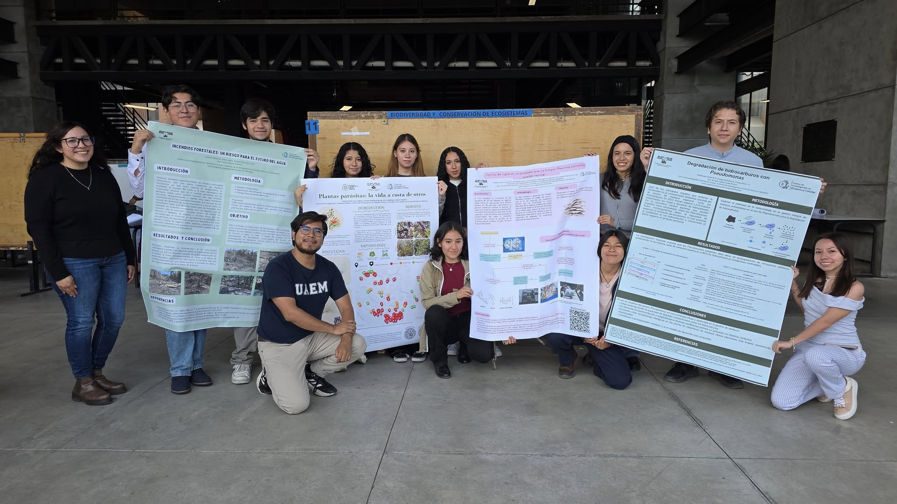
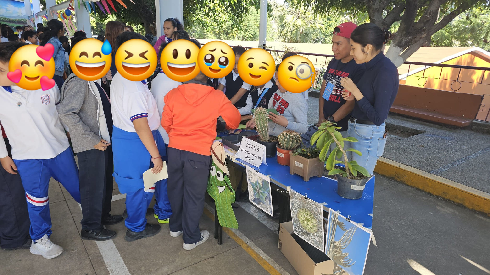

| [**🌵 HOME**](./index.html)| [**📝 RESEARCH**](./research.html)      | [**📚 PUBLICATIONS**](https://rodalg.github.io/publications.html)  | [**👥 PEOPLE**](./members.html)          |  [**🔊 OUTREACH**](./outreach.html) |  [**📰 NEWS**](./news.html) |

* * *

# Outreach & SciComm

At our lab, we understand that sharing our results is as important as generating them. We actively promote science outreach and communication efforts among our members, targeting diverse audiences, with a primary focus on the general public, whose taxes significantly fund our research. Below are some of our recent participation activities: 

### The struggle for life in the plant kingdom
> Most of us recognize plants as self-suficient, making their own food from thin air and sunlight. Last semester two undergrad students did a short stay at the lab trying to diagnose Viscum and Psyttacanthus (mistletoes) infections around our University Campus. These two plant genus include parasitic species, which steal the nutrients from their host trees. At our campus, mistletoe is a growing problem and diagnosing it is but the first step in a remedial strategy.
 

### Exploring the world of Cacti!
> We visited an elementary school to share the wonders of Cactaceae species with children. This time we wanted to share with them about cacti diversity: in shape, geographical distribution, height, organs and even flowers. It is always great to see kids's faces when learning some cacti have true leaves, that some cacti don't have spines, or that the thrive also in jungles and not only deserts!
 

### Organizing [#SMBPlant2023](https://smbplant.quimica.unam.mx)
> We are getting ready for #SMBPlants2023, the largest biochemistry and molecular plant biology meeting in México!
> This year, #SMBPlant2023 will take place in Oaxaca. More info? Get in touch via [Twitter](https://twitter.com/SMBPlant2023), [Mail](mailto:congresoplantas.smb@gmail.com), or visit our [Website](https://smbplant.quimica.unam.mx).
 

### Open Doors @ IBt - UNAM

*Disclaimer: Most of these activities were performed when I was at IBt-UNAM working with Dr. Svetlana Shishkova*

> Every two years at IBT-UNAM the doors are open for everyone to come see what we do in the lab.
> Here, some of my students made Cactus stamps, a photo gallery, live specimens showcase, and we
> even used augmented reality to take our visitors to the jungle in search of epiphytic cacti.

### Invited Speaker

> I was invited to the Autonomous University of Querétaro. We had a field trip to the campus Concá,
> visited part of the Sierra Gorda, and saw how the UAQ is working on sustainability. I had an interesting
> discussion with the students about how colonialism shaped botany, and how botany shaped empires.

# Science Fair

> Our group was invited to present some activities for students, from kindergarten to highschoolers.

